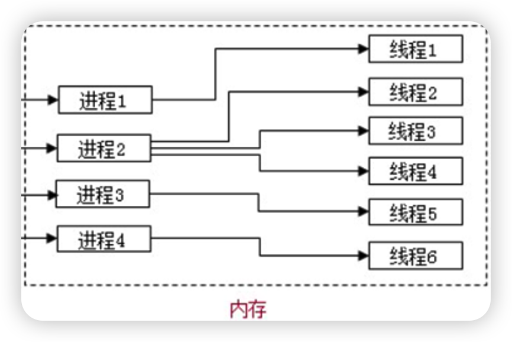
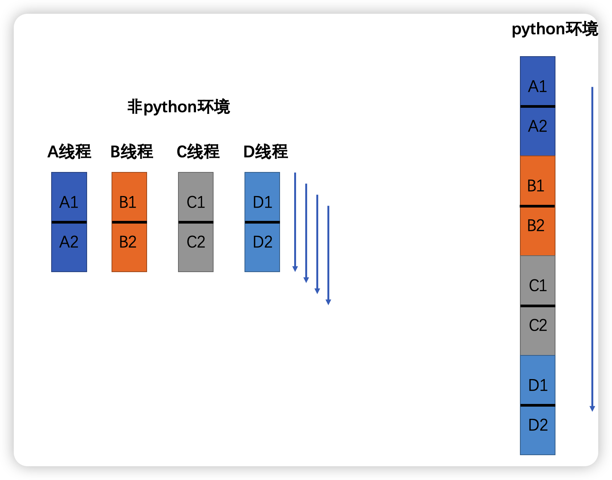

什么是线程？

线程也叫轻量级进程，是**操作系统能够进行运算调度**的最小单位。它被包含在进程之中，是**进程中的实际运作单位**。一个进程中可以有多个线程，这样的进程我们称之为多线程进程。 线程**不拥有系统资源**，只拥有一点在运行中必不可少的资源（如程序计数器，一组寄存器和栈），但是它可与**同属一个进程的其他的线程共享**进程所拥有的全部资源。

- 一个线程可以创建和撤销另一个线程
- 同一个进程中的多个线程之间可以并发执行
- 

使用多线程的优点?
- 进程之间不能共享内存，但线程之间共享内存非常容易
- 系统创建进程需要为该进程重新分配系统资源，但创建线程则**代价小得多**
- Python内置了多线程模块，实现多线程编程非常**简单**
  - 通过threading模块的Thread类来创建线程
  - 通过start方法来启动线程
  - 通过run方法定义线程要执行的代码
  - 通过join方法来等待线程执行结束
  - 通过name属性来获取线程的名字
  - 通过ident属性来获取线程的标识符
  - 通过is_alive方法来判断线程是否在运行
  - 通过daemon属性来设置线程是否随主线程退出而退出
  - 通过isDaemon方法来判断线程是否是守护线程
  - 通过daemon属性来设置线程是否是守护线程
  - 通过threading模块的current_thread方法来获取当前线程

多线程**共享全局变量**
- **线程是进程的执行单元**，进程是系统分配资源的最小执行单位
所以在**同一个进程中的多线程是共享资源的**

由于线程之间是进行随机调度，**当多个线程同时修改同一条数据时可能会出现脏数据**，所以出现了线程锁，即同一时刻允许一个线程执行操作。线程锁用于锁定资源

Python中为什么进程比线程好
- Python中的多线程并不是真正的多线程，而是**伪多线程**，因为Python中的多线程并不能发挥CPU的多核特性，只能在单个CPU上运行。

在非python语言中，多线程是真正的多线程，可以利用多核CPU的优势，但是在python中，如果想要发挥多核CPU的优势，可以使用多进程。python中的多进程才是真正意义上的多进程，可以利用多核CPU的优势。不论多少个核，线程数始终是1，因为GIL锁的存在，同一时间只能有一个线程在运行。

Python官方解释器(CPython)在内部**不是线程安全的**
因此它有一个**全局解释器锁 **(Global Interpreter Lock简称GIL）
它使得在任何时刻都**只有一个线程在执行Python字节码**。
这也是使得标准版本的Python并不能实现真正的多线程并发的直接原因。
简单来说就是，**一个Python进程永远不能在同一时刻使用多个CPU核心**。

**标准的 Python 解释器是cpython**

python针对**不同类型的代码执行效率**也是不同的

- **CPU密集型代码**（各种循环处理、**计算**等），在这种情况下，由于计算工作多，Ticks(计时周期数)很快就会达到阈值，然后触发GIL的释放与再竞争（**多个线程来回切换当然是需要消耗资源的**），所以python下的多线程对CPU密集型代码并不友好。
- IO密集型代码（**文件处理、网络爬虫**等设计文件读写操作），多线程能够有效提升效率（**单线程下有IO操作会进行IO等待，造成不必要的时间浪费，而开启多线程能在线程A等待时，自动切换到线程B，可以不浪费CPU的资源，从而能提升程序的执行效率**）。所以python的多线程对
IO密集型代码比较友好。

总结：I/O密集型任务，建议采取**多线程**，还可以采用**多进程+协程**的方式（例如：爬虫多采用多线程处理爬取的数据）;对于计算密集型任务，建议采取**python多进程**。