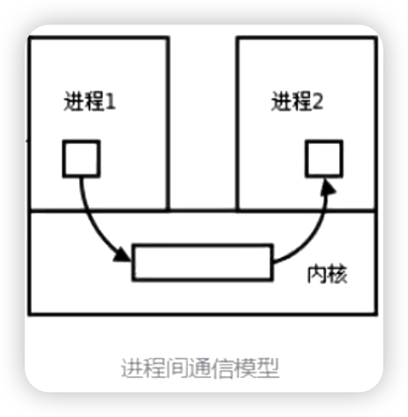

## 什么是进程

进程是**资源调度**的最小单位

进程是指在系统中正在运行的一个应用程序，程序一旦运行就是进程
进程是系统进行资源分配的独立实体,且每个进程拥有独立的地址空间

优点：
    并行执行多个任务,提高效率，创建方便，运行独立，不受其他进程的影响。数据安全

缺点:
    在进程的创建和删除的过程中消耗计算机的资源比较多。

-------
如果想要充分地使用多核CPU的资源,在python 中大部分情况需要使用多进程

为此,python 提供了multiprocessing 模块,它提供了一个Process类来代表一个进程对象

multiprocessing库
- 支持子进程
- 通信和共享数据
- 执行不同形式的同步
- 提供了Process,Queue、Pipe、Lock等组件

------

在multiprocessing中，每个进程都用一个Process类来表示。
`Process([group [, target [, name [, args [, kwargs]]]]])`

- target表示调用对象，即子进程要执行的任务（方法的名字）
- args表示调用对象的位置参数元组，args=(1,2,'egon',)
- kwargs表示调用对象的字典,kwargs={'name':'egon','age':18}
- name是别名，相当于给这个进程取一个名字
- group分组，实际上很少(不)使用

**start 方法用来启动进程**
**join 方法 主进程等待子进程完成后,再结束**

-----------

当你在Python中创建一个新的进程并启动它时，新的进程将开始并行运行。这意味着原始进程（我们通常称之为主进程）和新创建的进程（子进程）将同时运行。

p.join()方法是用于主进程等待子进程完成。如果你在主进程中调用了p.join()，那么主进程将暂停执行，直到子进程完成运行。

这在你需要等待子进程完成其工作，然后主进程才能继续执行时非常有用。例如，如果你的子进程正在进行一些计算，并且你需要在主进程中使用这些计算结果，那么你就需要在主进程中调用p.join()，以确保主进程在子进程完成计算之前不会继续执行。

------
daemon属性: 守护进程

- 主进程创建守护进程
- 守护进程会在主进程代码执行结束后就终止运行
- 守护进程内无法再开启子进程，否则抛出异常

注意:进程之间是相互独立的,进程之间不共享全局变量,进程之间的通信需要使用特定的方法，主进程代码运行结束，守护进程随即终止

---------
进程同步

Lock的使用
- 进程之间数据不共享,但是共享同一套文件系统,所以访问同一个文件，或同一个打印终端，是没有问题的，而**共享带来的是竞争**，竞争带来的结果就是**错乱**，**如何控制，就是加锁处理**

-----------
进程通信

每个进程各自有不同的用户地址空间,任何一个进程的**全局变量**在另一个进程中都看不到，所以进程之间要交换数据必须通过内核，在内核中开辟一块缓冲区,进程1把数据从用户空间拷到内核缓冲区,进程2再从内核缓冲区把数据读走,内核提供的这种机制称为**进程间通信（IPC, InterProcess Communication）**

进程间通信的7种方式

- 管道
- 队列
- 信号量
- 共享数据
- 事件
- 进程池

**管道**,顾名思义，一端发一端接收。管道有两种，一种是单向管道(half-duplex)，一种是双向管道(duplex)。 我们通过mutiprocessing.Pipe()函数来创建管道，该函数默认创建的是双向管道，也就是duplex=True，如果将duplex设置为False，那么该管道就是单向管道了。
  - 一个进程从Pipe 的一端输入对象,然后另一个进程从另一端获取,这样就实现了两个进程之间的通信；
  - 单向管道的话，就是一个进程负责写，另一个进程负责读，这样也可以实现进程间通信。
  - 双向管道的话，两个进程既可以读也可以写，这样也可以实现进程间通信。

**队列**

- 队列是实现进程间通信的一种方式，它是一个先进先出的数据结构，可以使用multiprocessing.Queue()函数来创建队列。
  - Queue([maxsize]):创建共享的进程队列
  - Queue 是多进程安全的队列，可以使用Queue实现多进程之间的数据传递。
  - 可以使用put方法将数据放入队列中，使用get方法将数据从队列中取出。
  - put_nowait方法和get_nowait方法是put方法和get方法的非阻塞版本。
  - full方法和empty方法分别是判断队列是否已满和是否为空的方法。
  - maxsize是队列中允许最大项数，省略则无大小限制。

----------------
实现多生成者，多消费者问题

JoinableQueue的介绍

这就像是一个Queue对象，但**队列允许项目的使用者**通知**生成者项目已经被成功处理**。
通知进程是使用共享的信号和条件变量来实现的。
JoinableQueue的实例p除了与Queue对象相同的方法和属性外，还具有额外的方法和属性：
- task_done()：使用者使用此方法发出信号，表示q.get()的返回项目已经被处理。如果调用此方法的次数大于从队列中删除项目的数量，将引发ValueError异常，未完成的任务数将小于零。
- join()：生产者调用此方法进行阻塞，直到队列中所有项目均被处理。阻塞将持续到队列中的每个项目均调用一次task_done()为止。

-------

Semaphore的使用

在多进程编程中，Semaphore（信号量）是一种同步机制，用于控制对共享资源的访问。**信号量维护一个内部计数器，这个计数器的值表示共享资源的数量**。当一个进程请求一个资源时，信号量的计数器会减一，当释放一个资源时，计数器会加一。**如果计数器的值为0，那么进程将阻塞，直到其他进程释放资**源。

信号量(英语：semaphore)又称为**信号标**，是一个同步对象，用于**保持在0至指定最大值之间的一个计数值**。当线程完成一次对该semaphore对象的等待（wait）时，该计数值减一；当线程完成一次对该semaphore对象的释放（release）时，计数值加一。当计数值为0时，则线程等待该信号量semaphore对象不再能成功直至该semaphore对象变成signaled状态。当计数值大于0时，semaphore对象为nonsignaled状态。

计数**信号量**具备两种操作动作，称为V（signal（））与P（wait（））（即部分参考书常称的**”PV操作”**）。V操作会增加信号标S的数值，P操作会减少它。
运作方式：
  - 初始化，给与它一个非负数的整数值。
  - 运行P（wait（）），信号标S的值将被减少。企图进入临界区段的进程，需要先运行P（wait（）。当信号标S减为负值时，进程会被挡住，不能继续；当信号标S不为负值时，进程可以获准进入临界区段。
  - 运行V（signal（），信号标S的值会被增加。结束离开临界区段的进程，将会运行V（signal（））。当信号标S不为负值时，先前被挡住的其他进程，将可获准进入临界区段。

----

当操作对象数目不大时,可以直接利用multiprocessing中的Process 动态生成多个进程，十几个还好,但如果是**上百个，上千个。。。手动的去限制进程数量却又太过繁琐**，这时候就可以用到multiprocessing中的**Pool方法**了。(进程池)

我们可以通过维护一个进程池来控制进程数目

Pool可以提供指定数量的进程,供用户调用。
- 当有新的请求提交到pool中时,如果池还没有满，那么就会创建一个新的进程用来执行该请求；
- 但如果池中的**进程数已经达到规定最大值**，那么该请求就会**等待**，**直到池中有进程结束**，就重用进程池中的进程。

Pool的默认大小是CPU的核数

参数介绍

Pool([processes[, initializer[, initargs]]]):创建进程池
- processes:指定进程池中的进程数,默认为CPU的核数,cup_count()的值
- initializer:是每个工作进程启动时要执行的可调用对象，默认为None
- initargs:是要传给initializer的参数组。默认为()

如果指定processes的值大于1,则创建的是多个进程,如果指定processes的值为None或者小于等于0,则创建的进程池中进程的数量会被设置为CPU的核数

如果指定process为3，则进程池会从无到有创建三个进程，然后自始至终使用这三个进程去执行所有任务，不会开启其他进程。

同步调用

同步调用：使用apply函数，**主进程会等待子进程完成任务后再继续执行**。

pool.apply(func[, args[, kwds]]):使用阻塞方式调用func函数

异步调用

异步调用：使用apply_async函数，**主进程不会等待子进程完成任务，而是立即返回并继续执行**。

pool.apply_async(func[, args[, kwds[, callback]]]):使用非阻塞方式调用func函数

- callback是回调,它是一个可调用对象,被pool中的一个进程调用,当调用结束时,将结果作为参数传入callback中

- pool.map(func, iterable[, chunksize]):使用阻塞方式调用func函数

- pool.map_async(func, iterable[, chunksize[, callback]]):使用非阻塞方式调用func函数

- pool.close():关闭pool,使其不在接受新的任务

- pool.join():主进程阻塞等待子进程的退出, **join方法要在close或terminate之后使用**

在Python中，信号量（Semaphore）和进程池（Pool）都是用于进程同步的工具，但它们的使用场景和工作方式有所不同。

1. 信号量（Semaphore）：信号量是一种同步机制，用于控制对共享资源的访问。信号量维护一个内部计数器，这个计数器的值表示共享资源的数量。当一个进程请求一个资源时，信号量的计数器会减一，当释放一个资源时，计数器会加一。如果计数器的值为0，那么进程将阻塞，直到其他进程释放资源。因此，信号量主要用于同步多个进程对共享资源的访问。

2. 进程池（Pool）：进程池是一种更高级的进程同步机制，它可以管理一组工作进程，并提供一种方便的方式来并行执行任务。进程池中的每个进程都可以独立地执行任务，而进程池会负责调度这些任务，并确保在任何时候只有一定数量的进程在运行。这使得进程池可以有效地利用多核CPU，并提高程序的执行速度。

在实际应用中，信号量和进程池都可以用于同步多个进程的执行，但它们的使用场景和工作方式有所不同。信号量主要用于同步对共享资源的访问，而进程池则主要用于并行执行任务。

在计算机科学中，信号量（Semaphore）和进程池（Pool）是两种不同的概念，通常用于多线程和多进程编程中，用于控制资源的访问和管理进程的执行。以下是它们的主要区别：

1. **信号量（Semaphore）**:
   - **定义**：信号量是一个同步机制，用于控制对共享资源的访问。它是一个变量，用于表示可用资源的数量。
   - **用途**：信号量主要用于解决多个线程或进程同时访问同一资源（如文件、内存等）时的同步问题。
   - **工作原理**：信号量有两个主要操作：等待（wait）和信号（signal）。当一个线程想要访问资源时，它会执行等待操作，这可能会导致线程阻塞，如果信号量的值为零。访问资源后，线程会执行信号操作，增加信号量的值，从而可能唤醒其他等待的线程。

2. **进程池（Pool）**:
   - **定义**：进程池是一种创建和管理进程的机制，它允许程序预先分配一定数量的进程，并在需要时重用这些进程。
   - **用途**：进程池主要用于控制程序中并发执行的进程数量，优化资源利用率和提高性能。
   - **工作原理**：进程池在程序开始时创建一定数量的进程。当有新的任务到来时，池中的一个空闲进程会被分配来执行这个任务。任务完成后，进程不会结束，而是返回池中，等待执行下一个任务。

总的来说，信号量是一种用于线程或进程间同步的机制，而进程池则是一种用于管理和优化进程创建与销毁成本的机制。二者在多线程和多进程编程中都扮演着重要角色，但它们的功能和用途各不相同。

在Python的多线程编程中，`join()` 方法和设置线程为守护线程（daemon thread）是两个不同的概念，它们用于不同的目的：

1. **join() 方法**:
   - `join()` 方法用于**等待线程完成其任务**。当你在一个线程上调用 `join()`，调用它的线程（通常是主线程）将会被阻塞，直到被 `join()` 的线程完成执行。
   - 这是一种线程同步的方法，确保一个线程在继续执行前等待另一个线程完成其任务。
   - 例如，在主线程中启动了多个工作线程后，可以在主线程中对每个工作线程调用 `join()`，以确保所有工作线程都完成了它们的任务，然后主线程才继续执行。

2. **守护线程（Daemon Thread）**:
   - 守护线程是**一种在后台运行的线程，其存在仅为服务于其他非守护线程（例如主线程）**。
   - 守护线程的一个关键特性是，**程序不会等待守护线程完成才结束。当所有非守护线程（如主线程）结束时，守护线程会被强制终止**。
   - 通过设置线程的 `daemon` 属性为 `True` 可以将线程设置为守护线程。这通常用于那些不重要的后台任务，它们应该在程序退出时自动结束。
   - 例如，如果你有一个用于定期保存数据或执行定期维护的线程，可能会将它设置为守护线程，这样当程序结束时，这个线程也会自动终止。

总之，`join()` 方法是用于等待线程完成的同步机制，而将线程设置为守护线程意味着告诉程序不需要等待这个线程完成即可退出。这两种方法在多线程程序设计中都非常有用，但它们的用途和行为截然不同。